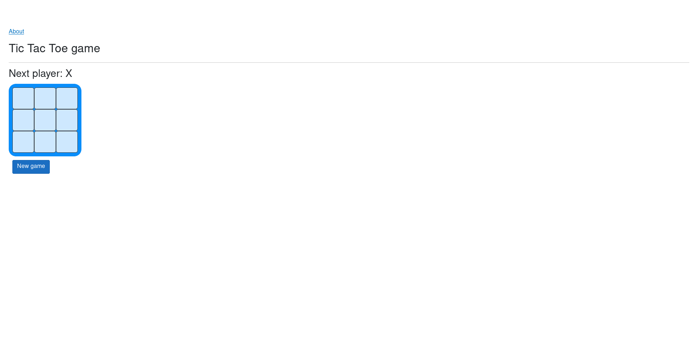
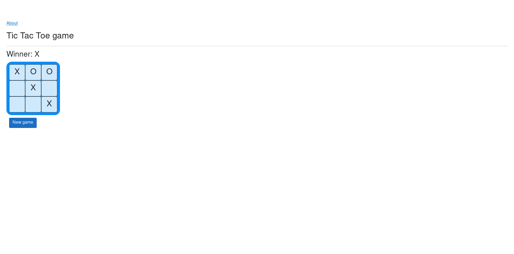
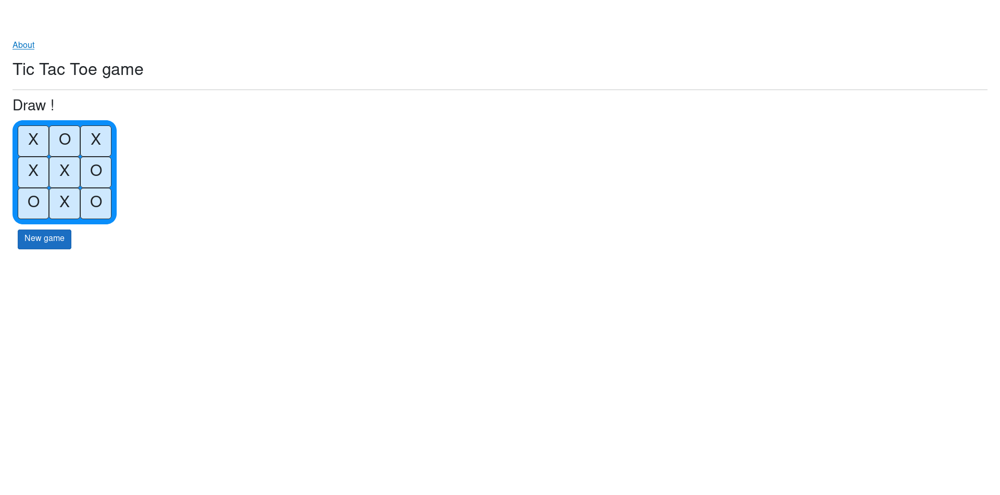

# TicTacToe

Простая игра в крестики-нолики, созданная для тестирования работы **Blazor WebAssembly** на .NET 6.

Проект реализован как SPA-приложение на Blazor WASM без сторонних библиотек. Основная цель — проверить жизненный цикл компонентов, биндинг данных, обработку событий и перерендеринг интерфейса.

## Технологии

- Blazor WebAssembly  
- .NET 6 (`net6.0`)  
- C#  
- Razor Components  

Используемые пакеты:

- `Microsoft.AspNetCore.Components.WebAssembly` (6.0.14)  
- `Microsoft.AspNetCore.Components.WebAssembly.DevServer` (6.0.14)  

## Возможности

- Игровое поле 3x3  
- Поочередный ход X и O  
- Проверка победителя  
- Определение ничьи  
- Блокировка ходов после завершения партии  
- Возможность перезапуска игры  

## Скриншоты

### Пустое поле



### Победа O


### Победа X



### Ничья



## Запуск проекта

``` bash
dotnet restore
dotnet run
````

Приложение запускается через встроенный DevServer и открывается в браузере.

## Назначение проекта

Проект создавался как учебный эксперимент для понимания:

* архитектуры Blazor WASM
* работы с компонентами
* управления состоянием в клиентском приложении
* обработки пользовательского ввода
* логики рендеринга без JavaScript